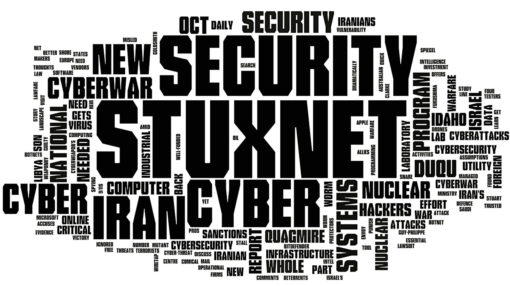
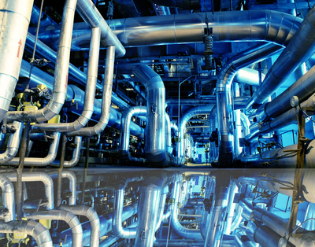
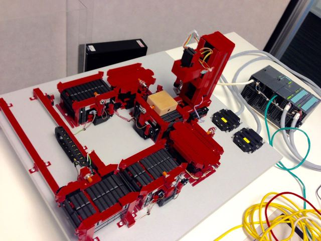
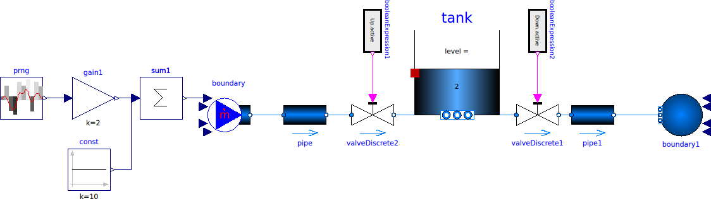
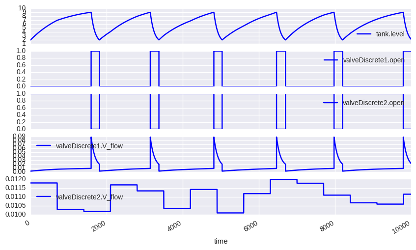
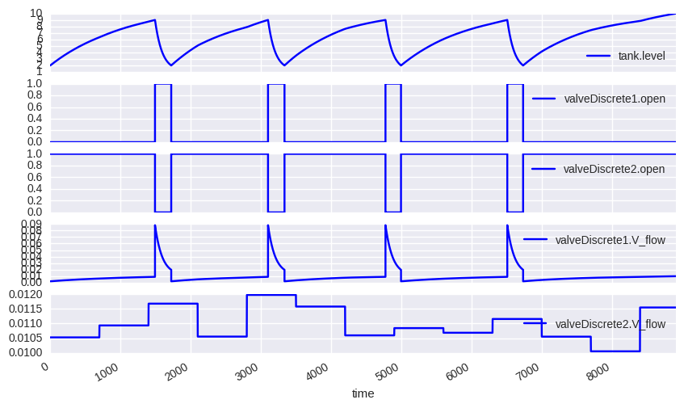
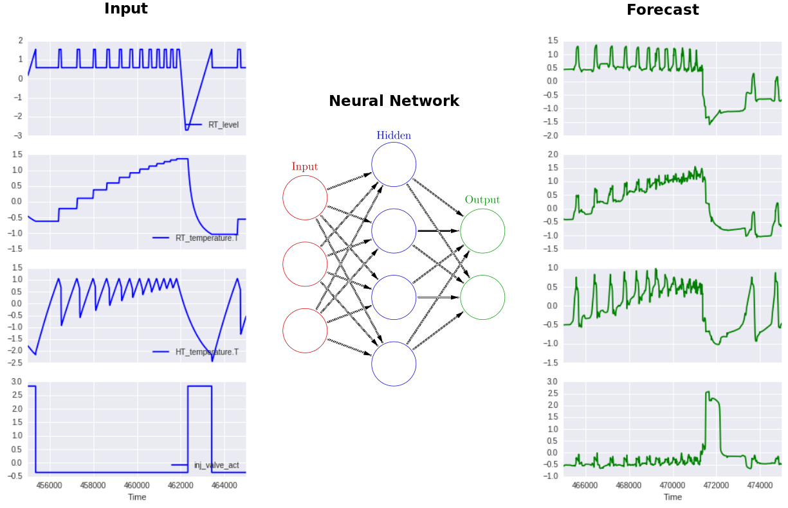

### Что получится если смешать индустриальную кибербезопасность, python и машинное обучение

Pavel.Filonov@kaspersky.com


### Несколько слов о себе

* основное образование - прикладная математика
* к.ф.-м.н  в области радиофизики
* опыт разработки ПО
    * web-разработка (PHP, Python, Javascript)
    * компьютерное зрение (C++)
    * программирование встраиваемых систем (С)
    * разработка мобильных приложений (Java)
    * разработка компиляторов DSL (Python)
    * разработка высоконагруженных систем (С++)
    * машинное обучение (Python, C++)


### О проблеме




### Методы противодействия

* контроль целостности сети
* контроль запуска приложений
* контроль подключения внешних устройств
* контроль целостности проектов ПЛК
* контроль целостности индустриального процесса <!-- .element: class="fragment highlight-red" -->


### контроль целостности индустриального процесса

* алгоритмы основанные на правилах

```lua
if frequency > 1000 then
    alert("Frequency is too high!")
endif
```

* алгоритмы основанные на данных

```python
#Train
X_train, y_train = get_train_data()
model.fit(X_train, y_train)

#Predict
X_test = get_test_data()
y_pred = model.predict(X_test)

#React
if fault_detected(y_pred):
    alert("Fault datected!")
```


### Примеры индустриальных систем



<small>Image from: http://www.imageif.com/image/industrial-engineering-is-an-interesting-field-for-those-technical</small>


### Натурные модели систем




### Компьютерные модели систем




### Показания сенсоров и управления




### Отклонения в ИП




### Идея решения




### Инструменты для построения нейронных сетей

| Framework   | Language    |
|-------------|-------------|
|  Torch      |  Lua, C     |
|  Theano     | Python      |
| Tensorflow  | Python, C++ |
| Caffe       | Python, C++ |
| Keras       | Python      |
| CNTK        | Python, C++ |


### Почему Python

* множество инструментов для машинного обучения <!-- .element: class="fragment" -->
  * sklearn, pandas, theano, keras, ...
* множество инструментов разработчки <!-- .element: class="fragment" -->
  * PyCharm, Jupyter, ...
* большое число различных библиотек <!-- .element: class="fragment" -->
* различные способы визуализации результатов <!-- .element: class="fragment" -->
  * Jupyter, PyQt, ...
* возможность интегрировать с другими языками <!-- .element: class="fragment" -->
  * CFFI, SWIG, Boost.Python, ...


 > Talk is cheap. Show me the code.
 
 Linus Torvalds

[Go to github.com]()


### Спасибо за внимание!

<table>
<tbody>
<tr><td>email</td><td>Pavel.Filonov@kaspersky.com</td></tr>
<tr><td>github</td><td><a href="https://github.com/sdukshis">sdukshis</a></td></tr>
<tr><td>skype</td><td>filonovpv</td></tr>
<tr><td>twitter</td><td>@filonovpv</td></tr>
</tbody>
</table>